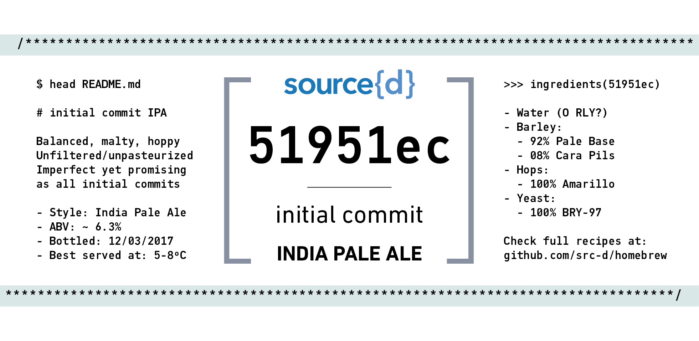

# 51951ec - initial commit IPA [](https://untappd.com/b/source-d-51951ec-initial-commit/2010128)

source{d}'s first homebrew beer—a humble IPA.

## Label



## Characteristics
Balanced, malty and hoppy. Unfiltered and unpasteurized.

## Recipe characteristics
- **Style**: India Pale Ale
- **Alcohol volume:** ```~6.3% ABV```
- **Bitterness:** ```~73 IBU```

## History

| Batch         | Brewed     | Bottled      |
|---------------|------------|--------------|
| #1 (Talks)    | 2017/02/19 | 2017/03/12   |

## Key brewer numbers
- **Total water used:** ```32 L```
- **Final beer volume:** ```16 L```
- **OG:** ```1060``` / **FG:** ```1012```
- **Hops added:**
  - ```25 g``` of Amarillo @ ```10 min```
  - ```25 g``` of Amarillo @ ```15 min```
  - ```17 g``` of Amarillo @ ```50 min```
  - ```17 g``` of Amarillo @ ```55 min```
- **Primary fermentation:** ```5 days```
- **Secondary fermentation:** ```8 days```
- **In-bottle fermentation:** ```13 days```
- **Carbonation (CO2)**: ```2.5 volumes```

## Ingredients

*All measurements use the [International System](https://en.wikipedia.org/wiki/International_System_of_Units). It's called that way for a reason. If you choose to live in the past, you can use [Google](https://www.google.com/search?q=kg+in+lbs) or to convert units.*

- **Water**
  - `10 L` water for strike
  - `20 L` water for mash
- **Malts**
  - `6.0 kg` Pale Base malt grain
  - `0.5 kg` Caramel Pilsen malt grain
- **Hops**
  - `84 g` Amarillo pellets
- **Yeast**
  - `22g` BRY-97 American West Coast Ale Yeast
  - `0.2 L` water for activating yeast
- **Priming (for CO2)**
  - `125 g` dextrose sugar (priming)
  - `0.5 L` water for priming

## Equipment

[The usual suspects](http://howtobrew.com/book/equipment-descriptions), being the boiling pan ```25 L``` large and the fermenter ```20 L``` large.
